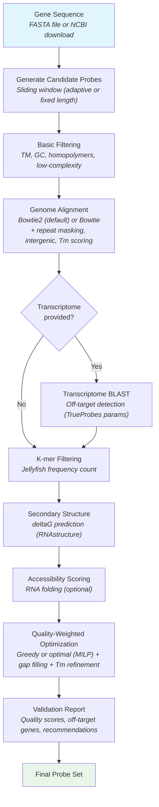

[]()
[](https://pypi.org/project/efishent/)
[]()
[](https://www.codefactor.io/repository/github/bbquercus/efishent)
[](https://codecov.io/gh/BBQuercus/eFISHent)
[](https://codeclimate.com/github/BBQuercus/eFISHent/maintainability)
[](https://zenodo.org/badge/latestdoi/501129295)


# eFISHent

Design RNA smFISH oligonucleotide probes from the command line. One command to install, one command to design probes.

**Key features:**

* Pre-built genome indices for 7 organisms — no index building needed
* Automatic gene sequence download from NCBI
* Multi-layer off-target detection (genome alignment, transcriptome BLAST, repeat masking, expression weighting, and more)
* Adaptive probe length to normalize Tm across the probe set
* Protocol presets (`smfish`, `merfish`, `dna-fish`, etc.)
* Automated probe validation with PASS/FLAG/FAIL recommendations

## Installation

Tested on macOS and Linux with Python 3.10+. Works on HPC/cluster servers via SSH — no sudo, Docker, or conda needed. For Windows, use [WSL](https://ubuntu.com/tutorials/install-ubuntu-on-wsl2-on-windows-11-with-gui-support#1-overview).

```bash
curl -LsSf https://raw.githubusercontent.com/BBQuercus/eFISHent/main/install.sh | bash
```

Restart your shell, then verify:

```bash
efishent --check
```

<details>
<summary><b>Installation options</b></summary>

**With BLAST+ and transcriptome tools** (for transcriptome-level off-target filtering):

```bash
curl -LsSf https://raw.githubusercontent.com/BBQuercus/eFISHent/main/install.sh | bash -s -- --with-blast
```

**Custom install path:**

```bash
curl -LsSf https://raw.githubusercontent.com/BBQuercus/eFISHent/main/install.sh | bash -s -- --prefix /path/to/install
```

**Update:**

```bash
efishent --update
```

**Development install:**

```bash
git clone https://github.com/BBQuercus/eFISHent.git
cd eFISHent/
./install.sh --deps-only
uv venv && source .venv/bin/activate
uv pip install -e .
```

**Uninstall:**

```bash
curl -LsSf https://raw.githubusercontent.com/BBQuercus/eFISHent/main/install.sh | bash -s -- --uninstall
```

Or simply: `rm -rf ~/.local/efishent`

</details>

## Quick Start

The fastest way to design probes — genome indices are downloaded automatically:

```bash
efishent --genome hg38 --gene-name "ACTB" --organism-name "homo sapiens" --preset smfish
```

That's it. This downloads the pre-built human genome index on first use and designs smFISH probes for ACTB.

### Available Genomes

| Organism | Aliases |
|---|---|
| Human | `hg38`, `GRCh38`, `human` |
| Mouse | `mm39`, `GRCm39`, `mouse` |
| Zebrafish | `danRer11`, `GRCz11`, `zebrafish` |
| Rat | `rn7`, `GRCr8`, `rat` |
| Drosophila | `dm6`, `BDGP6`, `fly` |
| C. elegans | `ce11`, `WBcel235`, `worm`, `elegans` |
| Yeast | `sacCer3`, `R64`, `yeast` |

```bash
efishent --list-genomes          # List all available genomes
efishent --download-genome hg38  # Pre-download for offline use
```

Indices are cached in `~/.local/efishent/indices/` by default. Override with `--index-cache-dir /path/to/dir` or the `EFISHENT_INDEX_DIR` environment variable.

### Specifying Your Target Gene

Three ways to provide the target sequence:

| Method | Example |
|---|---|
| Gene name + organism | `--gene-name "ACTB" --organism-name "homo sapiens"` |
| Ensembl ID | `--ensembl-id ENSG00000128272 --organism-name "homo sapiens"` |
| FASTA file | `--sequence-file ./my_gene.fasta` |

### Using Your Own Genome

For organisms without a pre-built index, provide your own reference genome:

```bash
# Build indices once (can take 30-60 min for large genomes)
efishent --reference-genome <genome.fa> --build-indices True

# Design probes
efishent --reference-genome <genome.fa> --gene-name <gene> --organism-name <organism>
```

<details>
<summary><b>Downloading genomes and annotations</b></summary>

For any organism, download the genome FASTA and GTF annotation from [Ensembl](https://www.ensembl.org/) or [UCSC](https://hgdownload.soe.ucsc.edu/downloads.html). Prefer `primary_assembly` if available, otherwise `toplevel`. Unzip with `gunzip`.

**Example for human (GRCh38):**

```bash
# Reference genome
wget https://ftp.ensembl.org/pub/current_fasta/homo_sapiens/dna/Homo_sapiens.GRCh38.dna.primary_assembly.fa.gz
gunzip Homo_sapiens.GRCh38.dna.primary_assembly.fa.gz

# GTF annotation (for intergenic filtering, rRNA filtering, expression weighting)
wget https://ftp.ensembl.org/pub/current_gtf/homo_sapiens/Homo_sapiens.GRCh38.115.gtf.gz
gunzip Homo_sapiens.GRCh38.115.gtf.gz
```

> Ensembl GTFs use `gene_biotype` while GENCODE uses `gene_type` — eFISHent supports both.

**Reference transcriptome** (optional, for BLAST cross-validation):

```bash
gffread Homo_sapiens.GRCh38.115.gtf -g Homo_sapiens.GRCh38.dna.primary_assembly.fa -w transcriptome.fa

# Append rRNA sequences (18S/28S/5.8S are NOT in standard GTFs)
efetch -db nucleotide -id NR_003286.4 -format fasta >> transcriptome.fa  # 45S pre-rRNA
efetch -db nucleotide -id NR_023363.1 -format fasta >> transcriptome.fa  # 5S rRNA
```

> The major rRNA genes exist in ~300 tandem copies in unassembled regions, so they're absent from standard GTFs. Including them in the transcriptome FASTA ensures the BLAST filter catches probes binding these abundant sequences.

**Count table** (optional, for expression-weighted filtering):

Download a normalized RNA-seq dataset (FPKM/TPM) for your cell line from [GEO](https://www.ncbi.nlm.nih.gov/gds/) or [Expression Atlas](https://www.ebi.ac.uk/gxa/home). The file needs Ensembl gene IDs in column 1 and normalized counts in column 2.

</details>

## Presets

Use `--preset` to apply optimized parameters for common FISH protocols:

| Preset | Description |
|--------|-------------|
| `smfish` | Standard smFISH (18-22nt probes, adaptive length, 10% formamide) |
| `merfish` | MERFISH encoding probes (tight Tm, 30% formamide) |
| `dna-fish` | DNA FISH (longer probes, relaxed specificity) |
| `strict` | Maximum specificity (low k-mer tolerance, low-complexity filter) |
| `relaxed` | Maximum probe yield (permissive thresholds + rescue filters) |
| `exogenous` | Exogenous genes — GFP, Renilla, reporters (no k-mer filter, strict BLAST) |

Use `--preset list` to see details. Explicit arguments override preset values.

<details>
<summary><b>Workflow</b></summary>



1. Candidate probes are generated from the input sequence using a sliding window. When `--adaptive-length` is enabled, probe lengths are adjusted based on local GC content to normalize Tm.
2. Basic filtering removes probes failing sequence criteria: melting temperature, GC content, homopolymer runs, optionally low-complexity regions, and optionally G-quadruplex motifs (`--filter-g-quadruplex`).
3. Probes are aligned to the reference genome using Bowtie2 (sensitive local alignment with OligoMiner/Tigerfish parameters). Optional filters refine off-target counting: repeat masking, intergenic filtering, thermodynamic scoring, and expression weighting.
4. If a reference transcriptome is provided, probes are BLASTed against expressed transcripts to catch off-targets that genome alignment alone may miss (e.g., splice junctions).
5. Short k-mers are counted using Jellyfish — probes with frequently occurring k-mers are discarded.
6. Secondary structure is predicted using a nearest-neighbor thermodynamic model — probes with too-stable structures are filtered.
7. If `--accessibility-scoring` is enabled, target RNA accessibility is scored using RNA folding predictions.
8. Quality-weighted optimization selects non-overlapping probes maximizing coverage. A gap-filling pass covers remaining regions and Tm uniformity refinement swaps outlier probes.
9. The output includes per-probe quality scores, off-target gene names, expression risk, and PASS/FLAG/FAIL recommendations.

</details>

## Output

eFISHent produces three files per run:

| File | Description |
|------|-------------|
| `GENE_HASH.fasta` | Final probes in FASTA format |
| `GENE_HASH.csv` | Detailed probe table (see columns below) |
| `GENE_HASH.txt` | Run parameters and command for reproducibility |

The `HASH` is a unique identifier based on the parameters used — rerunning with the same parameters reuses cached results.

<details>
<summary><b>Output CSV columns</b></summary>

| Column | Description |
|--------|-------------|
| `name` | Probe identifier |
| `sequence` | Probe nucleotide sequence |
| `start`, `end` | Position along the target gene |
| `length` | Probe length in nucleotides |
| `GC` | GC content (%) |
| `TM` | Predicted melting temperature (deg C) |
| `deltaG` | Secondary structure free energy (kcal/mol) |
| `kmers` | Maximum k-mer count in reference genome |
| `count` | Genome off-target hit count |
| `txome_off_targets` | Transcriptome off-target count (when `--reference-transcriptome` is used) |
| `off_target_genes` | Off-target gene names with hit counts, e.g., `ACTG1(3), MYH9(1)` |
| `worst_match` | Best off-target match quality, e.g., `95%/20bp/0mm` |
| `expression_risk` | Expression risk for off-target genes, e.g., `ACTG1:HIGH(850)` |
| `quality` | Composite quality score (0-100) |
| `recommendation` | `PASS`, `FLAG(reason)`, or `FAIL` |

</details>

### Probe Set Analysis

Analyze an existing probe set with comprehensive metrics and a PDF report:

```bash
efishent \
    --reference-genome <genome.fa> \
    --sequence-file <gene.fa> \
    --analyze-probeset <probes.fasta>
```

<details>
<summary><b>Analysis report contents</b></summary>

| Plot | Description |
|------|-------------|
| Lengths | Distribution of probe lengths |
| Melting temperatures | Boxplot of calculated Tm values |
| GC Content | Boxplot of GC percentages |
| G quadruplet | Count of G-quadruplet motifs per probe |
| K-mer count | Maximum k-mer frequency in genome |
| Free energy | Predicted secondary structure stability (deltaG) |
| Off target count | Number of off-target binding sites per probe |
| Binding affinity | Probe-to-probe similarity matrix (potential cross-hybridization) |
| Gene coverage | Visual map of probe positions along the target sequence |

</details>

## Parameters

### Core Parameters

| Parameter | Description |
|-----------|-------------|
| `--reference-genome` | Path to reference genome FASTA |
| `--genome` | Use a pre-built genome index (e.g., `hg38`, `mm39`, `zebrafish`) |
| `--gene-name` | Gene name for automatic sequence download from NCBI |
| `--organism-name` | Organism name (used with `--gene-name` or `--ensembl-id`) |
| `--sequence-file` | Path to target gene FASTA file |
| `--preset` | Parameter preset: `smfish`, `merfish`, `dna-fish`, `strict`, `relaxed`, `exogenous` |
| `--threads` | Number of threads for parallel processing |
| `--is-plus-strand` | Strand orientation of the gene of interest |
| `--is-endogenous` | Whether the gene is endogenous to the organism |

### Probe Design Parameters

| Parameter | Description |
|-----------|-------------|
| `--min-length`, `--max-length` | Probe length range in nucleotides |
| `--spacing` | Minimum distance between probes |
| `--min-tm`, `--max-tm` | Melting temperature range |
| `--min-gc`, `--max-gc` | GC content range (%) |
| `--formamide-concentration` | Formamide concentration (%) |
| `--na-concentration` | Sodium ion concentration (mM) |
| `--adaptive-length` | Adjust probe length by local GC to normalize Tm |
| `--max-homopolymer-length` | Max homopolymer run (default: 5, 0 to disable) |
| `--filter-low-complexity` | Filter dinucleotide repeats and low entropy regions |
| `--filter-g-quadruplex` | Filter G-quadruplex motifs in target |
| `--max-deltag` | Secondary structure free energy threshold |
| `--target-regions` | Target region: `exon` (default), `intron`, `both`, `cds-only`, `utr-only` |
| `--accessibility-scoring` | Score target RNA accessibility via RNA folding |
| `--optimization-method` | `greedy` (default, fast) or `optimal` (MILP, max coverage) |
| `--optimization-time-limit` | Time limit in seconds for optimal solver |
| `--sequence-similarity` | Max allowed inter-probe similarity (%) to avoid cross-hybridization |

<details>
<summary><b>Off-target filtering parameters</b></summary>

**Genome alignment** (default):

| Parameter | Description |
|-----------|-------------|
| `--max-off-targets` | Maximum genome hits per probe (default: 0) |
| `--aligner` | `bowtie2` (default) or `bowtie` (legacy) |
| `--mask-repeats` | Ignore off-targets in repetitive regions (uses dustmasker) |
| `--intergenic-off-targets` | Ignore off-targets outside annotated genes (requires `--reference-annotation`) |
| `--off-target-min-tm` | Min Tm (deg C) for an off-target to count. Set to hybridization temp to rescue thermodynamically unstable hits (default: 0) |
| `--filter-rrna` | Remove probes hitting rRNA genes (requires `--reference-annotation`) |

**Transcriptome BLAST** (optional):

| Parameter | Description |
|-----------|-------------|
| `--reference-transcriptome` | Transcriptome FASTA for BLAST cross-validation |
| `--max-transcriptome-off-targets` | Max transcriptome hits per probe (default: 0) |
| `--blast-identity-threshold` | Min % identity for BLAST hit (default: 75) |
| `--min-blast-match-length` | Min effective alignment length (default: max(18, 0.8 * min_probe_length)) |

**Expression weighting** (optional):

| Parameter | Description |
|-----------|-------------|
| `--reference-annotation` | GTF annotation file |
| `--encode-count-table` | Normalized RNA-seq count table (FPKM/TPM) |
| `--max-expression-percentage` | Top expression percentile to exclude |
| `--max-probes-per-off-target` | Cap on probes hitting same off-target gene (default: 0 = disabled, recommended: 5) |

</details>

<details>
<summary><b>Index and cache parameters</b></summary>

| Parameter | Description |
|-----------|-------------|
| `--build-indices` | Build genome indices (bowtie2, jellyfish, BLAST) |
| `--download-genome` | Pre-download a genome index for offline use |
| `--list-genomes` | List available pre-built genomes |
| `--index-cache-dir` | Override index cache directory (default: `~/.local/efishent/indices/`). Also settable via `EFISHENT_INDEX_DIR` |
| `--kmer-length` | K-mer length for Jellyfish filtering |
| `--max-kmers` | Max k-mer occurrences in genome before discarding probe |
| `--save-intermediates` | Keep all intermediate files for debugging |

</details>

## Examples

<details>
<summary><b>Full examples</b></summary>

**smFISH with pre-built index (simplest):**

```bash
efishent --genome hg38 --gene-name "ACTB" --organism-name "homo sapiens" --preset smfish --threads 8
```

**smFISH with full off-target filtering:**

```bash
efishent \
    --reference-genome ./hg-38.fa \
    --reference-annotation ./hg-38.gtf \
    --reference-transcriptome ./transcriptome.fa \
    --gene-name "GAPDH" \
    --organism-name "homo sapiens" \
    --preset smfish \
    --mask-repeats True \
    --intergenic-off-targets True \
    --filter-rrna True \
    --max-probes-per-off-target 5 \
    --threads 8
```

**Long probes (45-50nt) with optimal solver:**

```bash
efishent \
    --reference-genome ./hg-38.fa \
    --gene-name "norad" \
    --organism-name "homo sapiens" \
    --is-plus-strand True \
    --optimization-method optimal \
    --min-length 45 \
    --max-length 50 \
    --formamide-concentration 45 \
    --threads 8
```

**Exogenous gene (GFP, Renilla, etc.):**

```bash
efishent \
    --reference-genome ./hg38.fa \
    --reference-transcriptome ./transcriptome.fa \
    --reference-annotation ./hg38.gtf \
    --sequence-file "./renilla.fasta" \
    --preset exogenous \
    --threads 8
```

**Expression-weighted off-target filtering:**

```bash
efishent \
    --reference-genome ./hg-38.fa \
    --reference-annotation ./hg-38.gtf \
    --ensembl-id ENSG00000128272 \
    --organism-name "homo sapiens" \
    --is-plus-strand False \
    --max-off-targets 5 \
    --encode-count-table ./count_table.tsv \
    --max-expression-percentage 20 \
    --threads 8
```

**Rescue probes with thermodynamic and repeat masking filters:**

```bash
efishent \
    --reference-genome ./hg-38.fa \
    --reference-annotation ./hg-38.gtf \
    --sequence-file ./my_gene.fasta \
    --mask-repeats True \
    --intergenic-off-targets True \
    --off-target-min-tm 37 \
    --threads 8
```

</details>

## FAQ

Have questions? Open an issue on [GitHub](https://github.com/BBQuercus/eFISHent/issues).
