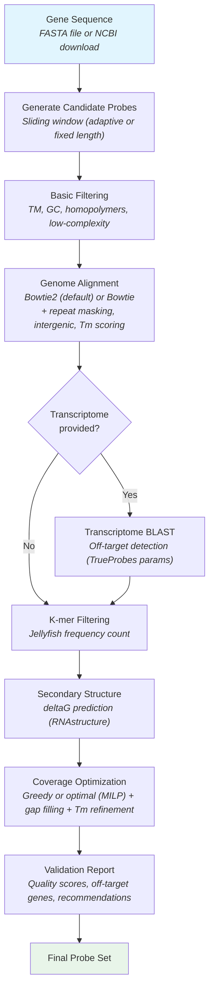

<!-- []() -->
[]()
[]()
[]()
[](https://www.codefactor.io/repository/github/bbquercus/efishent)
[](https://codecov.io/gh/BBQuercus/eFISHent)
[](https://codeclimate.com/github/BBQuercus/eFISHent/maintainability)
[](https://zenodo.org/badge/latestdoi/501129295)


# eFISHent

A command-line based tool to facilitate the creation of eFISHent single-molecule RNA fluorescence in-situ hybridization (RNA smFISH) oligonucleotide probes.

## Contents

- [Description](#description)
- [Installation](#installation)
- [Getting Genomes, Annotations, Count Tables](#getting-genomes-annotations-count-tables)
- [Workflow](#workflow)
- [Usage](#usage)
- [Output](#output)
- [Full Examples](#full-examples)
- [FAQ](#faq)

## Description

eFISHent is a tool to facilitate the creation of eFISHent RNA smFISH oligonucleotide probes. Some of the key features of eFISHent are:

* One-command installation — no sudo, Docker, or conda required
* Automatic gene sequence download from NCBI when providing a gene and species name (or pass a FASTA file)
* Parameter presets for common FISH protocols (`--preset smfish`, `merfish`, `dna-fish`, etc.)
* Adaptive probe length based on local GC content to normalize Tm across the probe set
* Multi-layer off-target detection: genome alignment, transcriptome BLAST, repeat masking, intergenic filtering, thermodynamic scoring, rRNA filtering, and expression weighting
* Automated probe validation report with per-probe PASS/FLAG/FAIL recommendations, off-target gene names, and expression risk annotation
* Quality scoring informed by Stellaris probe design principles (Tm uniformity, off-target weighting)
* Mathematical or greedy optimization to ensure highest coverage, with Tm uniformity refinement and cumulative off-target cap
* Filtering steps to remove low-quality probes including off-targets, frequently occurring short-mers, secondary structures, etc.

## Installation

eFISHent is tested on macOS and Linux with Python 3.9+. Works on shared HPC/cluster servers via SSH — no sudo, Docker, or conda needed. For Windows users, we recommend [WSL](https://ubuntu.com/tutorials/install-ubuntu-on-wsl2-on-windows-11-with-gui-support#1-overview).

### Quick Install (Recommended)

A single command installs eFISHent and all dependencies:

```bash
curl -LsSf https://raw.githubusercontent.com/BBQuercus/eFISHent/main/install.sh | sh
```

This will:
1. Download pre-compiled binaries for bowtie2, bowtie, jellyfish, BLAST+, GLPK, and Entrez Direct
2. Install Python and the eFISHent package in an isolated environment
3. Create an `efishent` command that works without any activation

After installation, restart your shell (or `source ~/.zshrc`) and you're ready:

```bash
efishent --check    # Verify all dependencies
efishent --help     # Show usage
```

### BLAST+ and Transcriptome Tools

For transcriptome-level off-target filtering, install BLAST+ and gffread:

```bash
curl -LsSf https://raw.githubusercontent.com/BBQuercus/eFISHent/main/install.sh | sh -s -- --with-blast
```

This installs `blastn`, `makeblastdb`, `dustmasker`, and `gffread` alongside the core dependencies.

### Custom Installation Path

```bash
curl -LsSf https://raw.githubusercontent.com/BBQuercus/eFISHent/main/install.sh | sh -s -- --prefix /path/to/install
```

### Updating

```bash
efishent --update
```

This updates both the Python package and verifies all external dependencies are still present and compatible.

### Checking Dependencies

```bash
efishent --check
```

Shows the status of all required and optional dependencies with version info.

### Using Conda

Alternatively, use [conda](https://conda.io/) to manage dependencies:

```bash
conda env create bbquercus/efishent
conda activate efishent
pip install efishent
```

### Development Installation

```bash
git clone https://github.com/BBQuercus/eFISHent.git
cd eFISHent/

# Install dependencies
./install.sh --deps-only

# Install development version
uv venv && source .venv/bin/activate
uv pip install -e .
```

### Uninstalling

```bash
curl -LsSf https://raw.githubusercontent.com/BBQuercus/eFISHent/main/install.sh | sh -s -- --uninstall
```

Or simply remove the install directory: `rm -rf ~/.local/efishent`

## Getting Genomes, Annotations, Count Tables

For some of the steps described below, you'll need to provide a few key resources unique to your model organism/cell line. Below is a quick-start for **human cells** (the most common use case), followed by general instructions for other organisms.

### Human Quick-Start (HeLa, HEK293, U2OS, etc.)

All human cell lines use the same reference genome and annotation — cell-line-specific differences don't affect probe design at the annotation level.

**1. Reference genome** (required)

Download the GRCh38 primary assembly from [Ensembl](https://ftp.ensembl.org/pub/current_fasta/homo_sapiens/dna/):

```bash
# Primary assembly excludes haplotype patches that inflate off-target counts
wget https://ftp.ensembl.org/pub/current_fasta/homo_sapiens/dna/Homo_sapiens.GRCh38.dna.primary_assembly.fa.gz
gunzip Homo_sapiens.GRCh38.dna.primary_assembly.fa.gz
```

**2. GTF annotation** (required for `--intergenic-off-targets`, `--filter-rrna`, expression filtering)

Download from [Ensembl](https://ftp.ensembl.org/pub/current_gtf/homo_sapiens/):

```bash
wget https://ftp.ensembl.org/pub/current_gtf/homo_sapiens/Homo_sapiens.GRCh38.115.gtf.gz
gunzip Homo_sapiens.GRCh38.115.gtf.gz
```

> Ensembl GTFs use `gene_biotype` while GENCODE uses `gene_type` — eFISHent supports both. Either source works, but Ensembl is recommended for consistency with the genome FASTA.

**3. Reference transcriptome** (optional, for BLAST cross-validation and comprehensive rRNA filtering)

Generate from your genome + GTF using [gffread](https://github.com/gpertea/gffread), then append rRNA sequences for comprehensive filtering:

```bash
# Generate transcriptome from genome + annotation
gffread Homo_sapiens.GRCh38.115.gtf -g Homo_sapiens.GRCh38.dna.primary_assembly.fa -w transcriptome.fa

# Download rRNA sequences (major 18S/28S/5.8S are NOT in standard GTFs)
# 45S pre-rRNA contains 18S, 5.8S, and 28S
efetch -db nucleotide -id NR_003286.4 -format fasta >> transcriptome.fa
# 5S rRNA
efetch -db nucleotide -id NR_023363.1 -format fasta >> transcriptome.fa
```

> **Why append rRNA?** The major rRNA genes (18S, 28S, 5.8S) exist in ~300 tandem copies in nucleolar organizer regions that are not assembled in GRCh38. They are absent from standard GTFs, so `--filter-rrna` alone won't catch them. Including them in the transcriptome FASTA ensures the BLAST filter removes probes binding these highly abundant sequences.

**4. Count table** (optional, for expression-weighted off-target filtering)

Download a HeLa (or your cell line) RNA-seq dataset:

1. Go to [GEO](https://www.ncbi.nlm.nih.gov/gds/) and search for your cell line + `RNA-seq` (e.g., `HeLa RNA-seq`)
2. Under `Supplementary file`, download files ending in `FPKM`, `TPM`, or `RPKMs.txt.gz` — **not raw counts**
3. Alternatively, use [Expression Atlas](https://www.ebi.ac.uk/gxa/home) — ensure the file has Ensembl IDs in column 1 and normalized counts in column 2

**Putting it all together** — recommended command for human smFISH:

```bash
# Build indices once
eFISHent \
    --reference-genome Homo_sapiens.GRCh38.dna.primary_assembly.fa \
    --build-indices True

# Design probes with all recommended filters
eFISHent \
    --reference-genome Homo_sapiens.GRCh38.dna.primary_assembly.fa \
    --reference-annotation Homo_sapiens.GRCh38.115.gtf \
    --reference-transcriptome transcriptome.fa \
    --gene-name "ACTB" \
    --organism-name "homo sapiens" \
    --preset smfish \
    --mask-repeats True \
    --intergenic-off-targets True \
    --filter-rrna True \
    --threads 8
```

### Other Organisms

For non-human organisms, follow the same pattern using your organism's Ensembl page or UCSC genome browser:

1. Go to [Ensembl](https://www.ensembl.org/) or [UCSC genome browser](https://hgdownload.soe.ucsc.edu/downloads.html)
2. Download the genome FASTA (`.fa.gz`) — prefer `primary_assembly` if available, otherwise `toplevel`
3. Download the GTF annotation (`.gtf.gz`) from the same source
4. Unzip both files with `gunzip`

## Workflow

eFISHent works by iteratively selecting probes passing various filtering steps as outlined below:

1. A list of all candidate probes is generated from an input FASTA file containing the gene sequence. This sequence file can be passed manually or downloaded automatically from NCBI when providing a gene and species name. When `--adaptive-length` is enabled, probe lengths are biased based on local GC content to normalize Tm.
2. The first round of filtering removes any probes not passing basic sequence-specific criteria including melting temperature (adjusted for formamide and salt concentrations), GC content, G-quadruplets, homopolymer runs (e.g., AAAAA), and optionally low-complexity regions (dinucleotide repeats, low Shannon entropy).
3. Probes are aligned to the reference genome using Bowtie2 (default, with OligoMiner/Tigerfish parameters for sensitive local alignment) or Bowtie (legacy). Candidates with off-targets are removed. Several optional filters can refine off-target counting:
   - **Repeat masking** (`--mask-repeats`): ignores off-target hits in repetitive/low-complexity regions identified by dustmasker
   - **Intergenic filtering** (`--intergenic-off-targets`): ignores off-target hits outside annotated genes (requires `--reference-annotation`)
   - **Thermodynamic scoring** (`--off-target-min-tm`): rescues probes whose off-target hits have predicted Tm below the hybridization temperature
   - **Expression weighting**: removes probes hitting highly expressed genes (requires count table)
4. If a reference transcriptome is provided, probes are BLASTed against expressed transcripts (using TrueProbes parameters) to catch off-target binding that genome alignment alone may miss — e.g., hits to processed mRNAs or splice junctions. The minimum effective match length is configurable via `--min-blast-match-length` (default: max(18, 0.8 * min_probe_length)).
5. The targets are divided into short k-mers and discarded if they appear above a determined threshold in the reference genome using Jellyfish.
6. The secondary structure of each candidate is predicted using a nearest neighbor thermodynamic model and filtered if the free energy is too low (too stable), which could result in motifs hindering hybridization.
7. This gives the set of all viable candidates which are still overlapping. The final step is to use mathematical or greedy optimization to maximize probe non-overlapping coverage across the gene sequence. A gap-filling pass then attempts to place additional probes in any remaining uncovered regions. A Tm uniformity refinement step swaps outlier probes for better alternatives.
8. The output CSV includes per-probe quality scores, transcriptome off-target details with gene name mapping, and automated PASS/FLAG/FAIL recommendations. If `--max-probes-per-off-target` is set, probes are removed to cap how many hit the same off-target gene.



## Usage

### Quick Start

```bash
eFISHent --reference-genome <reference-genome> --gene-name <gene> --organism-name <organism>
```

### Presets

Use `--preset` to apply optimized parameter sets for common FISH protocols:

```bash
eFISHent --reference-genome <genome> --gene-name <gene> --organism-name <organism> --preset smfish
```

| Preset | Description |
|--------|-------------|
| `smfish` | Standard smFISH (18-22nt probes, adaptive length, 10% formamide) |
| `merfish` | MERFISH encoding probes (tight Tm, 30% formamide) |
| `dna-fish` | DNA FISH (longer probes, relaxed specificity) |
| `strict` | Maximum specificity (low k-mer tolerance, low-complexity filter) |
| `relaxed` | Maximum probe yield (permissive thresholds + rescue filters) |
| `exogenous` | Exogenous genes — GFP, Renilla, reporters (no k-mer filter, strict BLAST) |

Use `--preset list` to see all available presets. Explicit arguments override preset values.

### Index Building

While there is only one main workflow, the slightly more time-intensive index creation step can be run ahead of time. Indexes are unique to each reference genome and can be created using:

```bash
eFISHent \
    --reference-genome <path to genome fasta file> \
    --build-indices True
```

### Passing Gene Sequence

The actual probe-creating workflow will then not only require the reference genome but also the sequence against which probes should be designed. Probes can be passed in one of three ways:

* `--sequence-file` - Path to a fasta file containing the gene sequence
* `--ensembl-id` (& `--organism-name`) - Ensembl ID of gene of interest. Will be downloaded from Entrez. The organism name can also be passed to avoid some wonky organism genes that have similar names but isn't required.
* `--gene-name` & `--organism-name` - Instead of ensembl ID, both gene and organism name can be provided. The sequence will also be downloaded from Entrez.

### Optimization Options

There are two ways in which the final set of probe candidates that passed filtering can be assigned/selected using `--optimization-method`:

* **greedy** - Uses the next best possibility in line starting with the first probe. This has a time complexity of `O(n)` with n being the number of candidates. Therefore, even with very loosely set parameters and a lot of candidates, this will still be very fast. This is the default option.
* **optimal** - Uses a mathematical optimization model to yield highest coverage (number of nucleotides bound to a gene). This has a time complexity of `O(n**2)` meaning the more probes there are the exponentially slower it will get. Despite breaking the problem into chunks, this might be restrictively slow. However, you can set a time limit (`--optimization-time-limit`) to stop the optimization process after a given amount of seconds. The resultant probes will be the best ones found so far.

After selection, a Tm uniformity refinement step checks each probe's deviation from the set median Tm and swaps outliers for alternatives at nearby positions when available.

### Off-Target Handling

eFISHent provides multiple layers of off-target detection. These can be combined for maximum specificity:

**Genome alignment** (default) - Probes are aligned to the reference genome using Bowtie2 (sensitive local alignment with OligoMiner/Tigerfish parameters) or Bowtie (legacy). Use `--max-off-targets` to set the maximum allowed genome hits (default: 0). Use `--aligner bowtie` to fall back to the legacy aligner.

**Transcriptome BLAST** (optional) - Probes are BLASTed against a reference transcriptome to catch off-target binding to expressed transcripts that genome alignment alone may miss (e.g., hits spanning splice junctions). BLAST parameters are derived from TrueProbes (Neuert Lab). Enable by providing:

* `--reference-transcriptome` - A FASTA file of expressed transcripts (generate from genome + GTF using [gffread](https://github.com/gpertea/gffread): `gffread annotation.gtf -g genome.fa -w transcriptome.fa`)
* `--max-transcriptome-off-targets` - Maximum transcriptome hits per probe (default: 0)
* `--blast-identity-threshold` - Minimum % identity for a BLAST hit to count (default: 75)
* `--min-blast-match-length` - Minimum effective alignment length for a hit to count (default: max(18, 0.8 * min_probe_length)). Lower values increase sensitivity but may cause excessive filtering for exogenous genes with chance partial matches

**Cumulative off-target cap** (optional) - Limits how many probes in the final set can hit the same off-target gene. Prevents correlated off-target binding that creates false FISH spots:

* `--max-probes-per-off-target` - Maximum probes hitting the same gene (default: 0 = disabled). When exceeded, lowest-quality probes are removed. Recommended: 5

**Repeat masking** (optional) - Ignores off-target hits landing in repetitive/low-complexity regions (Alu, LINE, SINE elements, etc.). Uses dustmasker from BLAST+ to identify repeats. This is often the biggest win for rescuing probes — 30-50% of spurious off-target hits can be in repeats:

* `--mask-repeats` - Enable repeat-masked off-target filtering (default: no)

**Intergenic off-target filtering** (optional) - Ignores off-target hits that don't overlap any annotated gene. For RNA FISH, intergenic regions don't produce transcripts the probe could bind:

* `--intergenic-off-targets` - Enable intergenic filtering (default: no, requires `--reference-annotation`)

**Thermodynamic off-target scoring** (optional) - Rescues probes whose off-target hits are thermodynamically unstable. Computes predicted Tm for each off-target alignment using the nearest-neighbor model; hits with Tm below the threshold are ignored:

* `--off-target-min-tm` - Minimum Tm (deg C) for an off-target to count. Recommended: set to your hybridization temperature (e.g., 37). Set to 0 to disable (default: 0)

**Ribosomal RNA filtering** (optional) - Removes probes with off-target hits on ribosomal RNA genes. rRNA constitutes ~80% of cellular RNA, so even weak off-target binding causes intense background signal. When a GTF annotation is provided, eFISHent checks `gene_biotype`/`gene_type` for rRNA and Mt_rRNA:

* `--filter-rrna` - Enable rRNA off-target filtering (default: no, requires `--reference-annotation`)

> **Note:** Standard GTF files (Ensembl/GENCODE) include 5S and mitochondrial rRNA genes but **miss the major 18S/28S/5.8S rRNA** — these are in unassembled tandem repeat regions. For comprehensive rRNA filtering, also use `--reference-transcriptome` with rRNA sequences included. You can download the human 45S pre-rRNA (GenBank `NR_003286.4`) and 5S rRNA (`NR_023363.1`) from NCBI, concatenate them with your transcriptome FASTA, and the transcriptome BLAST filter will catch probes binding these sequences.

**Expression-weighted filtering** (optional) - If genome off-targets are unavoidable, you can weight them by expression level to remove probes hitting highly expressed genes:

* `--reference-annotation` - A GTF genome annotation file to know which genes correspond to which genomic loci
* `--encode-count-table` - A `csv` or `tsv` file with any normalized RNA-seq count table format (FPKM, TPM, etc.) as well as the Ensembl ID matching the entries in the GTF file
* `--max-expression-percentage` - The percentage of genes to be excluded sorted based on expression level (using the provided count table)

If you don't have your own RNA-seq dataset, you can download available datasets (make sure you're not using raw, but only normalized counts!) at [Gene Expression Omnibus](https://www.ncbi.nlm.nih.gov/geo/). Search for `RNA-seq` and the name of your organism/cell line.

### General Filtering Parameters

There are a bunch of parameters that can be set to adjust filtering steps:

| Parameter | Description |
|-----------|-------------|
| `--min-length`, `--max-length` | Probe lengths in nucleotides |
| `--spacing` | Minimum distances between probes |
| `--min-tm`, `--max-tm` | Minimum and maximum possible melting temperature (affected by length, GC content, and formamide/Na concentration) |
| `--min-gc`, `--max-gc` | GC content in percentage |
| `--formamide-concentration` | Percentage of formamide in buffer |
| `--na-concentration` | Sodium ion concentration in mM |
| `--max-homopolymer-length` | Maximum homopolymer run length (e.g., AAAAA). Default: 5 (matches OligoMiner). Set to 0 to disable |
| `--filter-low-complexity` | Filter probes with dinucleotide repeats or low Shannon entropy regions |
| `--adaptive-length` | Adjust probe length based on local GC content to normalize Tm across the set. High-GC regions get shorter probes, low-GC regions get longer probes. Enabled by `smfish` preset |
| `--aligner` | Alignment tool: `bowtie2` (default, OligoMiner/Tigerfish params) or `bowtie` (legacy) |
| `--kmer-length`, `--max-kmers` | Jellyfish-based short-mer filtering. If candidate probes contain kmers of length `--kmer-length` that are found more than `--max-kmers` in the reference genome, the candidate will get discarded |
| `--max-deltag` | Predicted secondary structure threshold |
| `--sequence-similarity` | Will remove probes that might potentially bind to each other (set the similarity to the highest allowed binding percentage). Will reduce the number of probes because (due to otherwise exceptionally high runtimes) has to be run after optimization. Recommended: 75-85 for stringent designs |
| `--off-target-min-tm` | Minimum predicted Tm (deg C) for an off-target to count as significant. Set to hybridization temperature to rescue probes with thermodynamically unstable off-targets. Default: 0 (disabled) |
| `--mask-repeats` | Ignore off-target hits in repetitive/low-complexity regions (uses dustmasker from BLAST+) |
| `--intergenic-off-targets` | Ignore off-target hits outside annotated genes (requires `--reference-annotation`) |
| `--filter-rrna` | Remove probes with off-target hits on rRNA genes (requires `--reference-annotation`) |
| `--min-blast-match-length` | Minimum effective alignment length for transcriptome BLAST hits. Default: max(18, 0.8 * min_probe_length) |
| `--max-probes-per-off-target` | Cap on probes hitting same off-target gene. Default: 0 (disabled). Recommended: 5 |

### Remaining Options

There are a few additional options:

| Parameter | Description |
|-----------|-------------|
| `--is-plus-strand` | Set true/false depending on gene of interest |
| `--is-endogenous` | Set true/false depending on gene of interest |
| `--threads` | Wherever multiprocessing is available, spawn that many threads. Set this to as many cores as you have available |
| `--save-intermediates` | Save all intermediary files. Can be used to gauge which filtering steps are set too aggressively |
| `--preset` | Apply a parameter preset (`smfish`, `merfish`, `dna-fish`, `strict`, `relaxed`, `exogenous`). Use `--preset list` to see details |

### Probe Set Analysis

After generating a probe set, you can analyze it in more detail using the `--analyze-probeset` option. This creates a PDF report with visualizations of various probe characteristics:

```bash
eFISHent \
    --reference-genome <path to genome fasta file> \
    --sequence-file <path to gene fasta file> \
    --analyze-probeset <path to probe set fasta file>
```

The analysis includes:

| Plot | Description |
|------|-------------|
| Lengths | Distribution of probe lengths |
| Melting temperatures | Boxplot of calculated Tm values |
| GC Content | Boxplot of GC percentages |
| G quadruplet | Count of G-quadruplet motifs per probe |
| K-mer count | Maximum k-mer frequency in genome |
| Free energy | Predicted secondary structure stability (deltaG) |
| Off target count | Number of off-target binding sites per probe |
| Binding affinity | Probe-to-probe similarity matrix (potential cross-hybridization) |
| Gene coverage | Visual map of probe positions along the target sequence |

The output is saved as `<probeset_name>_analysis.pdf` in the current directory.

## Output

By default eFISHent will output three unique files:

* `GENE_HASH.fasta` - All probes in FASTA format for subsequent usage
* `GENE_HASH.csv` - A table containing all probes with detailed information (see below)
* `GENE_HASH.txt` - A configuration file to check which parameters were used during the run as well as the command to start it

### Output CSV Columns

| Column | Description |
|--------|-------------|
| `name` | Probe identifier |
| `sequence` | Probe nucleotide sequence |
| `start`, `end` | Position along the target gene |
| `length` | Probe length in nucleotides |
| `GC` | GC content (%) |
| `TM` | Predicted melting temperature (deg C) |
| `deltaG` | Secondary structure free energy (kcal/mol) |
| `kmers` | Maximum k-mer count in reference genome |
| `count` | Genome off-target hit count (from Bowtie2 alignment) |
| `txome_off_targets` | Transcriptome off-target count (when `--reference-transcriptome` is used) |
| `off_target_genes` | Comma-separated list of off-target gene names with hit counts, e.g., `ACTG1(3), MYH9(1)` |
| `worst_match` | Best off-target match quality, e.g., `95%/20bp/0mm` |
| `expression_risk` | Expression-level risk for off-target genes (when count table is provided), e.g., `ACTG1:HIGH(850)` |
| `quality` | Composite quality score (0-100) based on Tm uniformity, GC, deltaG, off-targets, and k-mer frequency |
| `recommendation` | Automated recommendation: `PASS`, `FLAG(reason)`, or `FAIL` |

`GENE` is a reinterpreted gene name dependent on the options passed but should be immediately clear as to where it's from. The `HASH` is a unique set of characters that identifies the parameters passed for the run. This way, if and only if the same parameters are passed again eFISHent doesn't have to rerun anything. All intermediary files during the run will be saved in the same format but will get deleted at the end unless `--save-intermediates` is set to true.

## Full Examples

First, the indexes for the respective genome have to be built:

```bash
eFISHent \
    --reference-genome ./hg-38.fa \
    --build-indices True
```

An example to create 45 to 50-mers for a gene of interest downloaded from Entrez:

```bash
eFISHent \
    --reference-genome ./hg-38.fa \
    --gene-name "norad" \
    --organism-name "homo sapiens" \
    --is-plus-strand True \
    --optimization-method optimal \
    --min-length 45 \
    --max-length 50 \
    --formamide-concentration 45 \
    --threads 8
```

An smFISH example with adaptive length and full off-target filtering:

```bash
eFISHent \
    --reference-genome ./hg-38.fa \
    --reference-annotation ./hg-38.gtf \
    --reference-transcriptome ./transcriptome.fa \
    --gene-name "GAPDH" \
    --organism-name "homo sapiens" \
    --preset smfish \
    --mask-repeats True \
    --intergenic-off-targets True \
    --filter-rrna True \
    --max-probes-per-off-target 5 \
    --threads 8
```

Another example using a custom sequence (exogenous gene):

```bash
eFISHent \
    --reference-genome ./hg38.fa \
    --reference-transcriptome ./transcriptome.fa \
    --reference-annotation ./hg38.gtf \
    --sequence-file "./renilla.fasta" \
    --preset exogenous \
    --threads 8
```

An example with off-target weighting:

```bash
eFISHent \
    --reference-genome ./hg-38.fa \
    --reference-annotation ./hg-38.gtf \
    --ensembl-id ENSG00000128272 \
    --organism-name "homo sapiens" \
    --is-plus-strand False \
    --max-off-targets 5 \
    --encode-count-table ./count_table.tsv \
    --max-expression-percentage 20 \
    --threads 8
```

An example using advanced off-target filtering for maximum probe yield:

```bash
eFISHent \
    --reference-genome ./hg-38.fa \
    --reference-annotation ./hg-38.gtf \
    --sequence-file ./my_gene.fasta \
    --mask-repeats True \
    --intergenic-off-targets True \
    --off-target-min-tm 37 \
    --threads 8
```

Lastly, an example to analyze an existing probe set:

```bash
eFISHent \
    --reference-genome ./hg-38.fa \
    --sequence-file ./my_gene.fasta \
    --analyze-probeset ./my_gene_probes.fasta
```

## FAQ

Have questions? Open an issue on [GitHub](https://github.com/BBQuercus/eFISHent/issues).
